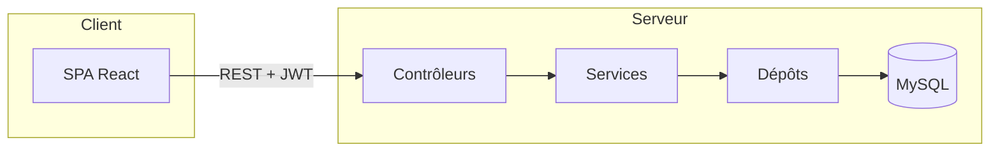

# SmartQueue — Référence technique (`explain.fr.md`)

Ce document explique **comment le projet SmartQueue est construit**, quelles **technologies** sont utilisées, ce que signifient les **modèles courants** (DTO, entité, dépôt, etc.), **comment les requêtes HTTP traversent** les contrôleurs, les services et la base de données, et propose une **visite dossier par dossier / fichier par fichier** de l’arborescence source (hors artefacts générés et `node_modules`).

**Documents liés :** [README.md](README.md) (vue d’ensemble), [setup.md](setup.md) (installation et exécution). **Version anglaise :** [explain.md](explain.md).

---

## Table des matières

1. [Objectifs et périmètre](#1-objectifs-et-périmètre)
2. [Pile technologique](#2-pile-technologique)
3. [Glossaire des concepts (DTO, entité, service, …)](#3-glossaire-des-concepts-dto-entité-service-)
4. [Architecture en couches et flux des requêtes](#4-architecture-en-couches-et-flux-des-requêtes)
5. [Backend (`BE/`)](#5-backend-be)
6. [Frontend (`FE/`)](#6-frontend-fe)
7. [Configuration et fichiers externes](#7-configuration-et-fichiers-externes)
8. [Modèle de sécurité (JWT, rôles, CORS, WebSocket)](#8-modèle-de-sécurité-jwt-rôles-cors-websocket)
9. [Base de données et persistance](#9-base-de-données-et-persistance)
10. [Résumé de l’API REST](#10-résumé-de-lapi-rest)
11. [Ce qui *n’est pas* documenté ligne par ligne](#11-ce-qui-nest-pas-documenté-ligne-par-ligne)
12. [Annexe A — Index complet des sources Java (`BE/src`)](#annexe-a--index-complet-des-sources-java-besrc)
13. [Annexe B — Index complet des sources frontend (`FE/src`)](#annexe-b--index-complet-des-sources-frontend-fesrc)

---

## 1. Objectifs et périmètre

* **Objectif :** gestion administrative de files d’attente : tickets, services, rendez-vous, notifications, avec authentification **JWT** et mises à jour **temps réel** optionnelles via **STOMP/WebSocket**.
* **Ce document** décrit le **code applicatif** sous `BE/src` et `FE/src`. Il **ne** liste **pas** chaque fichier dans **`node_modules/`** ni **`BE/target/`** (sortie de compilation).

---

## 2. Pile technologique

### 2.1 Backend

| Technologie | Rôle dans ce projet |
|-------------|----------------------|
| **Java 17** | Langage ; déclaré dans `BE/pom.xml` (`java.version`). |
| **Spring Boot** | Conteneur d’application : auto-configuration, serveur web embarqué, starters. |
| **Spring Web MVC** | `@RestController`, mapping HTTP, JSON via **Jackson**. |
| **Spring Data JPA** | Interfaces `JpaRepository`, dérivation de requêtes, gestion des entités. |
| **Hibernate** | Implémentation JPA ; génère du SQL et fait le mapping objets ↔ tables. |
| **MySQL** | SGBDR ; URL JDBC dans `application.properties`. |
| **Spring Security** | Chaîne de filtres, authentification, `authorizeHttpRequests`, encodage des mots de passe. |
| **JJWT** (`io.jsonwebtoken`) | Création et lecture des JWT dans `JwtService`. |
| **Lombok** | Réduit le code répétitif (`@Data`, `@Builder`, `@RequiredArgsConstructor`, …). Nécessite le traitement des annotations à la compilation. |
| **Spring WebSocket / STOMP** | `WebSocketConfig` — préfixe broker `/topic`, point de connexion `/ws-queue`. |
| **Maven** | Outil de build ; scripts wrapper `mvnw` / `mvnw.cmd`. |

### 2.2 Frontend

| Technologie | Rôle dans ce projet |
|-------------|----------------------|
| **React** | Bibliothèque UI (structure type CRA sous `FE/`). |
| **react-router-dom** | Routes côté client (`BrowserRouter`, `Route`, `Navigate`). |
| **Axios** | Client HTTP ; URL de base depuis `REACT_APP_API_URL` ; ajoute l’en-tête `Authorization`. |
| **@stomp/stompjs** | Client STOMP pour WebSocket `/ws-queue`, abonnement à `/topic/tickets`. |
| **npm** | Gestionnaire de paquets ; scripts dans `FE/package.json`. |

---

## 3. Glossaire des concepts (DTO, entité, service, …)

### 3.1 Entité (JPA)

* **Définition :** classe Java annotée `@Entity` qui **correspond à une table** (ou structure de jointure). Les champs mappent des colonnes ; `@ManyToOne`, `@OneToMany`, etc., mappent les associations.
* **Dans SmartQueue :** `User`, `Ticket`, `ServiceEntity`, `Appointment`, `Role`, `Notification`, `Counter`, … sous `BE/src/main/java/com/smartqueue/entity/`.
* **Pourquoi c’est important :** les entités sont le **modèle métier persisté dans MySQL**. On ne les expose pas toujours telles quelles à l’API si l’on veut un contrat stable ou masquer des champs — on utilise alors des **DTO**.

### 3.2 DTO (*Data Transfer Object* — objet de transfert de données)

* **Définition :** objet **simple** (souvent une classe ou un record) servant à **transporter des données à une frontière** — typiquement les **corps de requêtes/réponses HTTP** — sans exposer le détail de la persistance.
* **Rôle :** définir la **forme du JSON** envoyé ou reçu par le client (ex. `LoginRequest`, `RegisterRequest`, `AuthResponse`).
* **Ce n’est pas :** une copie obligatoire 1:1 d’une table ; souvent un **sous-ensemble** ou une **combinaison** de champs d’entités.
* **Dans SmartQueue :** `com.smartqueue.dto.*` et `com.smartqueue.dto.auth.*`. Certains fichiers DTO sont des **emplacements réservés** (ex. `AppointmentDTO` vide) pour une future refactorisation.

### 3.3 Dépôt (*Repository*)

* **Définition :** interface **Spring Data JPA** qui étend `JpaRepository<Entity, IdType>`. Spring fournit une **implémentation à l’exécution** (proxies).
* **Fait :** `save`, `findById`, `delete`, méthodes `findBy...` dérivées du nom, `@Query`, `@EntityGraph`, etc.
* **Ne fait pas :** HTTP ni règles métier ; **pas** de `@RestController` ici.
* **Dans SmartQueue :** `UserRepository`, `TicketRepository`, … sous `repository/`.

### 3.4 Service (couche métier)

* **Définition :** classe **`@Service`** Spring (ou interface + implémentation) qui réalise des **cas d’usage** : validation, orchestration de plusieurs dépôts, règles (ex. « prochain ticket en attente »).
* **Communique avec :** les dépôts (parfois d’autres services, utilitaires, ou `SimpMessagingTemplate` pour le WebSocket).
* **Ne fait pas :** le mapping HTTP direct ; ce sont les **contrôleurs** qui appellent les services.

### 3.5 Contrôleur (*Controller*)

* **Définition :** classe **`@RestController`** qui associe **URL et méthodes HTTP** à des méthodes Java ; les objets retournés sont sérialisés en **JSON** par Jackson.
* **Communique avec :** les services uniquement (bonne pratique), pas directement les dépôts — dans ce projet cette règle est **globalement** respectée.
* **Dans SmartQueue :** `*Controller` sous `controller/`.

### 3.6 Injection de dépendances (IDI) et inversion de contrôle (IoC)

* **IoC :** Spring **instancie** les beans (contrôleurs, services, …) et **injecte** les dépendances.
* **Injection par constructeur** (via Lombok `@RequiredArgsConstructor` sur des champs `private final`) : au démarrage, Spring fournit `TicketService`, `JwtAuthenticationFilter`, etc.

### 3.7 JWT (*JSON Web Token*)

* **Qu’est-ce que c’est :** chaîne signée (souvent jeton `Bearer`) contenant des **revendications** (*claims*) (ex. sujet = e-mail, expiration).
* **Dans SmartQueue :** émis à la connexion/inscription par `JwtService`, envoyé par le client dans l’en-tête `Authorization`, validé dans `JwtAuthenticationFilter` avant les contrôleurs sécurisés.

### 3.8 JPA vs JDBC

* **JDBC :** API de bas niveau pour exécuter du SQL.
* **JPA :** persistance orientée objet ; Hibernate génère du SQL JDBC à partir des entités.
* **Spring Data JPA :** réduit le code répétitif des dépôts au-dessus de JPA.

---

## 4. Architecture en couches et flux des requêtes

### 4.1 Flux textuel (HTTP)

```text
Client (navigateur / React)
    → requête HTTP (corps JSON, en-têtes : Authorization: Bearer <JWT>)
        → conteneur de servlets (Tomcat embarqué)
            → chaîne de filtres Spring Security (CORS, filtre JWT, …)
                → DispatcherServlet
                    → méthode du contrôleur (@GetMapping, @PostMapping, …)
                        → méthode du service (logique métier)
                            → méthode du dépôt (persistance)
                                → Hibernate / JDBC
                                    → MySQL
```

La réponse repasse par le **même chemin** ; entités ou DTO sérialisées en **JSON** par défaut.

### 4.2 Schéma (simplifié)



### 4.3 Comment le **Service** parle au **Dépôt** et au **Contrôleur**

* **Contrôleur → Service :** injection par constructeur (`private final XxxService`) ; le contrôleur appelle par ex. `ticketService.callNextTicket()`.
* **Service → Dépôt :** injection d’une ou plusieurs interfaces `XxxRepository` ; le service appelle `ticketRepository.findFirstByStatusOrderByCreatedAtAsc(...)`, puis `save(...)` si besoin.
* **Dépôt → Base :** Spring Data génère l’implémentation ; Hibernate exécute le SQL.
* **Service → WebSocket :** `TicketServiceImpl` peut appeler `SimpMessagingTemplate.convertAndSend(...)` pour pousser des événements aux abonnés STOMP.

---

## 5. Backend (`BE/`)

### 5.1 Fichier de build racine

| Fichier | Rôle |
|---------|------|
| **`BE/pom.xml`** | Projet Maven : parent Spring Boot, dépendances (Web, Data JPA, Security, WebSocket, pilote MySQL, JJWT, Lombok), `spring-boot-maven-plugin`, `maven-compiler-plugin` avec **chemin du processeur d’annotations Lombok** (`${lombok.version}`). |

### 5.2 `BE/src/main/java/com/smartqueue/`

| Fichier | Rôle |
|---------|------|
| **`SmartqueueApplication.java`** | Point d’entrée `@SpringBootApplication` : `main` lance Spring Boot ; scan des composants sous `com.smartqueue`. |

### 5.3 `controller/`

Adaptateurs REST ; chemins sous `/api/...` sauf mention contraire.

| Fichier | Rôle |
|---------|------|
| **`AuthController`** | `POST /api/auth/register`, `POST /api/auth/login`, `GET /api/auth/me` (utilisateur courant). |
| **`TicketController`** | Tickets : `POST` (paramètres `userId`, `serviceId`), `GET` liste, `PUT` appel suivant, `PUT` clôture par id. |
| **`UserController`** | Endpoints type CRUD utilisateurs : liste, détail, suppression. |
| **`ServiceEntityController`** | Entités « service administratif » (à ne pas confondre avec un bean Spring `@Service`) : API HTTP CRUD. |
| **`AppointmentController`** | Création, liste, suppression de rendez-vous. |
| **`NotificationController`** | Liste par id utilisateur, création de notification. |
| **`AdminController`** | Endpoint réservé admin (ex. santé sous `/api/admin/...`). |

### 5.4 `service/` et `service/impl/`

Les interfaces déclarent les opérations ; les implémentations contiennent la logique.

| Interface | Implémentation | Rôle |
|-----------|----------------|------|
| `AuthService` | `AuthServiceImpl` | Inscription / connexion ; émission JWT ; `getProfile(email)`. |
| `TicketService` | `TicketServiceImpl` | Création de ticket, liste, appel suivant, clôture ; peut diffuser des événements WebSocket. |
| `UserService` | `UserServiceImpl` | Opérations utilisateur pour `UserController`. |
| `ServiceEntityService` | `ServiceEntityServiceImpl` | CRUD sur `ServiceEntity`. |
| `AppointmentService` | `AppointmentServiceImpl` | Cycle de vie des rendez-vous. |
| `NotificationService` | `NotificationServiceImpl` | Création et requêtes de notifications par utilisateur. |

### 5.5 `repository/`

Interfaces Spring Data JPA.

| Fichier | Usage typique |
|---------|----------------|
| **`UserRepository`** | `findByEmail`, `@EntityGraph` optionnel pour charger le `role` sans requêtes N+1. |
| **`RoleRepository`** | Recherche des rôles par `RoleName`. |
| **`TicketRepository`** | Requêtes sur les tickets, ex. prochain `WAITING`. |
| **`ServiceEntityRepository`** | Accès aux définitions de services. |
| **`AppointmentRepository`** | Persistance des rendez-vous. |
| **`NotificationRepository`** | Notifications par utilisateur. |
| **`CounterRepository`** | Persistance des guichets (*Counter*) si utilisé. |

### 5.6 `entity/`

Entités JPA. Le dossier **`enums/`** contient `TicketStatus`, `AppointmentStatus`, `RoleName`, `NotificationType`.

| Fichier | Notes |
|---------|-------|
| **`User`** | Compte utilisateur ; lien vers `Role` ; mot de passe souvent `@JsonIgnore` à la sérialisation. |
| **`Role`** | Ligne de rôle ; enum `RoleName`. |
| **`Ticket`** | Ticket de file : numéro, statut, liens vers utilisateur, service, guichet, agent. |
| **`ServiceEntity`** | Type de service proposé (nom, durée, actif). |
| **`Appointment`** | Rendez-vous planifié ; utilisateur + service. |
| **`Notification`** | Message utilisateur ; visibilité JSON du champ `user` selon création vs réponse. |
| **`Counter`** | Guichet (physique ou logique). |

### 5.7 `dto/`

| Fichier | Rôle |
|---------|------|
| **`dto/auth/LoginRequest`**, **`RegisterRequest`** | Corps JSON pour l’authentification. |
| **`dto/auth/AuthResponse`** | Enveloppe du jeton JWT après login/register. |
| **`LoginDTO`**, **`TicketRequestDTO`**, **`TicketResponseDTO`**, **`AppointmentDTO`** | Anciens ou futurs contrats d’API ; certains peuvent être vides. |

### 5.8 `security/`

| Chemin | Rôle |
|--------|------|
| **`security/config/SecurityConfig`** | `SecurityFilterChain` : CORS, CSRF désactivé, filtre JWT, `authorizeHttpRoutes` (public login/register, règles admin/agent). |
| **`security/jwt/JwtAuthenticationFilter`** | Étend `OncePerRequestFilter` ; lit le jeton Bearer, valide, remplit `SecurityContext`. |
| **`security/jwt/JwtService`** | Génère et analyse les jetons ; secret et durée depuis la config. |
| **`security/service/CustomUserDetailsService`** | Charge l’utilisateur par e-mail pour Spring Security (`UserDetails`), attache les autorités `ROLE_*` depuis la BDD. |

### 5.9 `config/`

| Fichier | Rôle |
|---------|------|
| **`CorsConfig`** | Bean `CorsConfigurationSource` : origines autorisées (ex. dev React), méthodes, en-têtes. |
| **`WebSocketConfig`** | `@EnableWebSocketMessageBroker`, point STOMP `/ws-queue`, préfixe broker `/topic`, constante de sujet tickets. |
| **`DataInitializer`** | `CommandLineRunner` pour insérer les rôles s’ils manquent. |
| **`SwaggerConfig`** | Espace réservé pour OpenAPI/Swagger (peut être vide). |

### 5.10 `exception/`

| Fichier | Rôle |
|---------|------|
| **`GlobalExceptionHandler`** | `@ControllerAdvice` : exceptions → statut HTTP + corps JSON. |
| **`BadRequestException`**, **`ResourceNotFoundException`** | Exceptions métier typées (400, 404). |

### 5.11 `util/`

| Fichier | Rôle |
|---------|------|
| **`DateUtil`** | Espace réservé — helpers date/heure (actuellement souvent vide). |
| **`TicketGenerator`** | Espace réservé — génération de numéros de ticket (actuellement souvent vide). |

### 5.12 Ressources

| Fichier | Rôle |
|---------|------|
| **`src/main/resources/application.properties`** | URL datasource, JPA, secret JWT, durée de vie, options Hibernate. |

### 5.13 Tests

| Fichier | Rôle |
|---------|------|
| **`src/test/java/.../SmartqueueApplicationTests.java`** | Test de chargement du contexte Spring (fumée). |

---

## 6. Frontend (`FE/`)

**Racine :** `FE/package.json` — scripts `start`, `build`, `test` ; dépendances React, `react-router-dom`, `axios`, `@stomp/stompjs`, outils de test.

| Chemin | Rôle |
|--------|------|
| **`public/index.html`** | Coquille HTML ; `div#root` pour React. |
| **`.env.development`** | `REACT_APP_API_URL`, `REACT_APP_WS_URL` pour l’API / WebSocket locaux. |
| **`src/index.js`** | Rendu ReactDOM `<App />`, import de `index.css`. |
| **`src/App.js`** | `AuthProvider`, `BrowserRouter`, tableau des routes, `Layout`, `ProtectedRoute`, routes par rôle (`/agent`, `/admin`). |
| **`src/index.css`** | Styles globaux (mise en page, cartes, tableaux, boutons). |
| **`src/api/client.js`** | Instance Axios + intercepteur qui ajoute le JWT depuis `localStorage`. |
| **`src/context/AuthContext.jsx`** | État `user`, `token`, `login`, `register`, `logout`, `refreshUser` ; appel `/api/auth/me` si jeton présent. |
| **`src/components/Layout.jsx`** | En-tête : `Navbar`, `<Outlet />`, pied de page. |
| **`src/components/Navbar.jsx`** | Liens selon authentification et rôle. |
| **`src/components/ProtectedRoute.jsx`** | Redirection vers login si non connecté ; liste de rôles optionnelle. |
| **`src/hooks/useTicketSocket.js`** | Client STOMP vers `REACT_APP_WS_URL/ws-queue`, abonnement `/topic/tickets`, rappel à chaque message. |
| **`src/services/authService.js`** | `login`, `register`, `getMe`. |
| **`src/services/ticketService.js`** | Appels REST tickets. |
| **`src/services/serviceService.js`** | CRUD services. |
| **`src/services/appointmentService.js`** | Rendez-vous. |
| **`src/services/notificationService.js`** | Notifications. |
| **`src/services/adminService.js`** | Endpoint santé admin. |
| **`src/pages/HomePage.jsx`** | Page d’accueil. |
| **`src/pages/LoginPage.jsx`** / **`RegisterPage.jsx`** | Formulaires branchés sur `AuthContext`. |
| **`src/pages/DashboardPage.jsx`** | Liens du tableau de bord. |
| **`src/pages/QueuePage.jsx`** | Prise de ticket, liste « mes tickets », rafraîchissement WebSocket. |
| **`src/pages/AgentPage.jsx`** | Appeler suivant, terminer ticket ; AGENT/ADMIN. |
| **`src/pages/ServicesPage.jsx`** | Liste / création / suppression services (création/suppression admin). |
| **`src/pages/AppointmentsPage.jsx`** | Réservation et liste des rendez-vous. |
| **`src/pages/NotificationsPage.jsx`** | Liste + démo de création. |
| **`src/pages/AdminPage.jsx`** | Appel API admin. |
| **`src/App.test.js`** | Test de rendu minimal de `App`. |
| **`src/setupTests.js`**, **`reportWebVitals.js`** | Configuration des tests CRA et métriques optionnelles. |

**Remarque :** les fichiers sous **`FE/node_modules/`** sont des bibliothèques tierces (des milliers de fichiers), installés par **`npm install`** — ce n’est **pas** le code métier du projet.

---

## 7. Configuration et fichiers externes

| Emplacement | Rôle |
|-------------|------|
| `BE/.../application.properties` | Configuration Spring principale. |
| `FE/.env.development` | Variables React pour URL API et WebSocket. |
| `BE/mvnw`, `BE/mvnw.cmd` | Maven Wrapper : compiler sans Maven global. |

---

## 8. Modèle de sécurité (JWT, rôles, CORS, WebSocket)

* **Connexion :** le client envoie les identifiants en `POST` ; le serveur renvoie un JWT. Le client stocke le jeton (ex. `localStorage`) et envoie `Authorization: Bearer …` ensuite.
* **Chaîne de filtres :** `JwtAuthenticationFilter` s’exécute avant le contrôleur ; si le jeton est valide, authentification dans `SecurityContext`.
* **Autorisation :** `SecurityConfig` avec `authorizeHttpRequests` : chemins `permitAll`, `authenticated()`, `hasRole` / `hasAnyRole`.
* **Rôles :** stockés en entités/enums (`RoleName`) ; Spring Security attend des autorités du type `ROLE_*` dérivées de la BDD.
* **CORS :** le navigateur envoie des requêtes **preflight** `OPTIONS` en cross-origin ; le bean CORS doit autoriser l’origine du frontend (ex. `http://localhost:3000`).
* **WebSocket :** la poignée STOMP peut être `permitAll` ; en production on authentifie souvent la trame **CONNECT** — voir `SecurityConfig` du projet pour les règles exactes.

---

## 9. Base de données et persistance

* Les tables sont dérivées des **entités** lorsque `ddl-auto` vaut `update` (pratique de développement).
* Relations : ex. un `User` possède plusieurs `Ticket` ; un `Ticket` appartient à un `ServiceEntity` ; un `User` a un `Role`.
* Les identifiants sont souvent `GenerationType.IDENTITY` (auto-incrément MySQL).

Pour un schéma ER visuel, se baser sur les champs des entités (§ 5.6).

---

## 10. Résumé de l’API REST

| Domaine | Méthodes (typiques) |
|---------|---------------------|
| Auth | `POST /api/auth/register`, `POST /api/auth/login`, `GET /api/auth/me` |
| Tickets | `GET/POST /api/tickets`, `PUT` appel suivant, `PUT` clôture |
| Utilisateurs | `GET/DELETE` sous `/api/users` |
| Services | `GET/POST/DELETE` sous `/api/services` |
| Rendez-vous | `GET/POST/DELETE` sous `/api/appointments` |
| Notifications | `GET /api/notifications/{userId}`, `POST /api/notifications` |
| Admin | `GET /api/admin/...` |

Les chemins et paramètres exacts correspondent aux classes `*Controller` ; voir **§ 5.3**.

---

## 11. Ce qui *n’est pas* documenté ligne par ligne

* **`BE/target/`** — classes compilées et artefacts Maven (régénérés).
* **`FE/build/`** — bundle de production après `npm run build`.
* **`FE/node_modules/`** — dépendances npm (définies par `package-lock.json`).
* **Fichiers IDE / OS** — `.vscode/`, `.idea/`, etc., s’ils existent.
* **Journaux d’exécution** — non versionnés.

---

## Annexe A — Index complet des sources Java (`BE/src`)

Chemins sous `BE/src/main/java/com/smartqueue/` sauf mention. Tests : `BE/src/test/java/com/smartqueue/`.

### Racine applicative

| Fichier | Responsabilité |
|---------|----------------|
| `SmartqueueApplication.java` | Bootstrap Spring Boot (`main`), scan des composants `com.smartqueue`. |

### `controller/`

| Fichier | Responsabilité |
|---------|----------------|
| `AdminController.java` | Cartographie `/api/admin/**` (ex. santé pour ADMIN). |
| `AppointmentController.java` | `/api/appointments` — créer, lister, annuler par id. |
| `AuthController.java` | `/api/auth/register`, `/api/auth/login`, `/api/auth/me`. |
| `NotificationController.java` | `/api/notifications` — liste par id utilisateur, création. |
| `ServiceEntityController.java` | `/api/services` — CRUD des services administratifs. |
| `TicketController.java` | `/api/tickets` — créer (paramètres), lister, suivant, clôturer. |
| `UserController.java` | `/api/users` — liste, détail, suppression. |

### `service/` (interfaces)

| Fichier | Responsabilité |
|---------|----------------|
| `AppointmentService.java` | Contrat des cas d’usage rendez-vous. |
| `AuthService.java` | Contrat inscription, connexion, profil. |
| `NotificationService.java` | Contrat notifications. |
| `ServiceEntityService.java` | Contrat CRUD `ServiceEntity`. |
| `TicketService.java` | Contrat opérations file d’attente. |
| `UserService.java` | Contrat opérations utilisateur. |

### `service/impl/`

| Fichier | Responsabilité |
|---------|----------------|
| `AppointmentServiceImpl.java` | Persistance rendez-vous via `AppointmentRepository`. |
| `AuthServiceImpl.java` | Inscription (mot de passe haché), JWT, login, `getProfile`. |
| `NotificationServiceImpl.java` | Charge utilisateur, persistance / lecture notifications. |
| `ServiceEntityServiceImpl.java` | CRUD services. |
| `TicketServiceImpl.java` | Création, liste, suivant, clôture ; peut publier STOMP. |
| `UserServiceImpl.java` | Service utilisateur utilisé par `UserController`. |

### `repository/`

| Fichier | Responsabilité |
|---------|----------------|
| `AppointmentRepository.java` | Accès JPA `Appointment`. |
| `CounterRepository.java` | Accès JPA `Counter` (guichet). |
| `NotificationRepository.java` | Requêtes `Notification` (ex. par utilisateur). |
| `RoleRepository.java` | Trouver `Role` par `RoleName`. |
| `ServiceEntityRepository.java` | CRUD `ServiceEntity`. |
| `TicketRepository.java` | Tickets par statut ordonné, numéro, utilisateur, agent, etc. |
| `UserRepository.java` | `findByEmail` avec `@EntityGraph(role)` optionnel, `existsByEmail`. |

### `entity/`

| Fichier | Responsabilité |
|---------|----------------|
| `Appointment.java` | Entité JPA rendez-vous. |
| `Counter.java` | Entité JPA guichet. |
| `Notification.java` | Entité JPA notification. |
| `Role.java` | Entité JPA rôle (`RoleName`). |
| `ServiceEntity.java` | Entité JPA service administratif. |
| `Ticket.java` | Entité JPA ticket de file. |
| `User.java` | Entité JPA usager / agent (lien `Role`). |

#### `entity/enums/`

| Fichier | Responsabilité |
|---------|----------------|
| `AppointmentStatus.java` | Enum : PENDING, CONFIRMED, … |
| `NotificationType.java` | Enum : INFO, WARNING, SUCCESS. |
| `RoleName.java` | Enum : USER, AGENT, ADMIN. |
| `TicketStatus.java` | Enum : WAITING, CALLED, IN_PROGRESS, COMPLETED, CANCELLED. |

### `dto/`

| Fichier | Responsabilité |
|---------|----------------|
| `AppointmentDTO.java` | Espace réservé — futur contrat API rendez-vous (peut être vide). |
| `LoginDTO.java` | Ancien ou DTO login alternatif (peut être vide / inutilisé). |
| `TicketRequestDTO.java` | Espace réservé — forme requête tickets. |
| `TicketResponseDTO.java` | Espace réservé — forme réponse tickets. |

#### `dto/auth/`

| Fichier | Responsabilité |
|---------|----------------|
| `AuthResponse.java` | Enveloppe du JWT renvoyé au client. |
| `LoginRequest.java` | E-mail + mot de passe pour le corps JSON login. |
| `RegisterRequest.java` | Champs d’inscription (nom, e-mail, mot de passe, téléphone). |

### `security/config/`

| Fichier | Responsabilité |
|---------|----------------|
| `SecurityConfig.java` | Définit `SecurityFilterChain`, encodeur de mots de passe, gestionnaire d’auth, ordre du filtre JWT. |

### `security/jwt/`

| Fichier | Responsabilité |
|---------|----------------|
| `JwtAuthenticationFilter.java` | Filtre une fois par requête : extraire Bearer, valider, remplir le contexte de sécurité. |
| `JwtService.java` | Construire / analyser JWT ; clé et expiration depuis la configuration. |

### `security/service/`

| Fichier | Responsabilité |
|---------|----------------|
| `CustomUserDetailsService.java` | `UserDetailsService` — charger l’utilisateur par e-mail, mapper les rôles vers `GrantedAuthority`. |

### `config/`

| Fichier | Responsabilité |
|---------|----------------|
| `CorsConfig.java` | Bean CORS `CorsConfigurationSource` pour les navigateurs. |
| `DataInitializer.java` | Insertion des rôles au démarrage si absents. |
| `SwaggerConfig.java` | **Stub vide** — réservé à Springdoc / Swagger / OpenAPI. |
| `WebSocketConfig.java` | Configuration broker STOMP, `/ws-queue`, préfixes `/topic`. |

### `exception/`

| Fichier | Responsabilité |
|---------|----------------|
| `BadRequestException.java` | Erreurs client de type 400. |
| `GlobalExceptionHandler.java` | Mappe les exceptions vers les réponses HTTP. |
| `ResourceNotFoundException.java` | Ressource absente (style 404). |

### `util/`

| Fichier | Responsabilité |
|---------|----------------|
| `DateUtil.java` | **Stub vide** — helpers date partagés. |
| `TicketGenerator.java` | **Stub vide** — logique de numéros de ticket. |

### `test/`

| Fichier | Responsabilité |
|---------|----------------|
| `SmartqueueApplicationTests.java` | Test de chargement du contexte Spring. |

### `resources/`

| Fichier | Responsabilité |
|---------|----------------|
| `application.properties` | Datasource, JPA (`ddl-auto`, `show-sql`), JWT, pilote JDBC. |

---

## Annexe B — Index complet des sources frontend (`FE/src`)

Le code tiers dans `FE/node_modules/` **n’est pas** listé ici.

### Entrée et enveloppe

| Fichier | Responsabilité |
|---------|----------------|
| `index.js` | Rendu racine ReactDOM, import `index.css`. |
| `App.js` | Routeur, `AuthProvider`, routes, garde `ProtectedRoute`. |
| `index.css` | Mise en page globale, tableaux, boutons, alertes. |
| `App.test.js` | Test de rendu minimal de `App`. |
| `setupTests.js` | Configuration Jest / DOM pour CRA. |
| `reportWebVitals.js` | Hooks performance CRA (optionnel). |

### `api/`

| Fichier | Responsabilité |
|---------|----------------|
| `client.js` | Instance Axios, `baseURL`, intercepteur jeton Bearer. |

### `context/`

| Fichier | Responsabilité |
|---------|----------------|
| `AuthContext.jsx` | État auth, `login` / `register` / `logout`, amorçage `getMe`. |

### `components/`

| Fichier | Responsabilité |
|---------|----------------|
| `Layout.jsx` | Coque : barre de nav + `Outlet` + pied. |
| `Navbar.jsx` | Navigation selon rôle. |
| `ProtectedRoute.jsx` | Garde d’authentification et rôles optionnels. |

### `hooks/`

| Fichier | Responsabilité |
|---------|----------------|
| `useTicketSocket.js` | Cycle de vie client STOMP + abonnement `/topic/tickets`. |

### `pages/`

| Fichier | Responsabilité |
|---------|----------------|
| `HomePage.jsx` | Accueil et appels à l’action. |
| `LoginPage.jsx` | Formulaire de connexion. |
| `RegisterPage.jsx` | Formulaire d’inscription. |
| `DashboardPage.jsx` | Hub après connexion. |
| `QueuePage.jsx` | File utilisateur : ticket, liste, WebSocket. |
| `AgentPage.jsx` | File agent : suivant, clôturer. |
| `ServicesPage.jsx` | Services ; création/suppression admin. |
| `AppointmentsPage.jsx` | Rendez-vous ; liste perso ou tout (admin). |
| `NotificationsPage.jsx` | Liste + démo création. |
| `AdminPage.jsx` | Appel REST admin. |

### `services/` (clients REST côté FE)

| Fichier | Responsabilité |
|---------|----------------|
| `authService.js` | `login`, `register`, `getMe`. |
| `ticketService.js` | Appels REST tickets. |
| `serviceService.js` | API entités service. |
| `appointmentService.js` | API rendez-vous. |
| `notificationService.js` | API notifications. |
| `adminService.js` | API santé admin. |

### Autres ressources racine `src/` (si présentes)

| Fichier | Responsabilité |
|---------|----------------|
| `logo.svg` | Logo CRA par défaut (optionnel). |

### `public/`

| Fichier | Responsabilité |
|---------|----------------|
| `index.html` | Gabarit HTML, `title`, `div` racine. |
| `favicon.ico`, `manifest.json`, etc. | Ressources statiques du template CRA. |

### Configuration projet (hors `src/`)

| Fichier | Responsabilité |
|---------|----------------|
| `FE/package.json` | Dépendances, scripts `npm`. |
| `FE/package-lock.json` | Arbre de dépendances verrouillé. |
| `FE/.env.development` | Variables `REACT_APP_*` en dev (souvent gitignored). |
| `FE/README.md` | Notes courtes spécifiques au frontend. |

---

*Fin de `explain.fr.md`. Mettez à jour ce fichier lorsque les paquets, points de terminaison ou noms de fichiers changent.*
