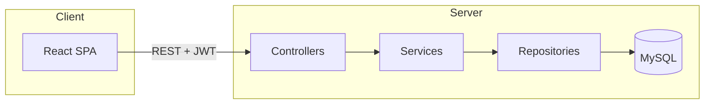

# SmartQueue — Technical reference (`explain.md`)

This document explains **how the SmartQueue project is built**, which **technologies** are used, what **common patterns** mean (DTO, entity, repository, etc.), **how HTTP requests flow** through controllers, services, and the database, and gives a **per-folder / per-file** tour of the source tree (excluding generated artifacts and `node_modules`).

**Companion docs:** [README.md](README.md) (overview), [setup.md](setup.md) (install & run). **French version:** [explain.fr.md](explain.fr.md).

---

## Table of contents

1. [Goals and boundaries](#1-goals-and-boundaries)
2. [Technology stack](#2-technology-stack)
3. [Concept glossary (DTO, Entity, Service, …)](#3-concept-glossary-dto-entity-service-)
4. [Layered architecture and request flow](#4-layered-architecture-and-request-flow)
5. [Backend (`BE/`)](#5-backend-be)
6. [Frontend (`FE/`)](#6-frontend-fe)
7. [Configuration and external files](#7-configuration-and-external-files)
8. [Security model (JWT, roles, CORS, WebSocket)](#8-security-model-jwt-roles-cors-websocket)
9. [Database and persistence](#9-database-and-persistence)
10. [REST API summary](#10-rest-api-summary)
11. [What is *not* documented line-by-line](#11-what-is-not-documented-line-by-line)

---

## 1. Goals and boundaries

* **Purpose:** administrative queue management: tickets, services, appointments, notifications, with **JWT**-based auth and optional **real-time** updates over **STOMP/WebSocket**.
* **This document** describes the **application source** under `BE/src` and `FE/src`. It does **not** enumerate every file inside **`node_modules/`** or **`BE/target/`** (build output).

---

## 2. Technology stack

### 2.1 Backend

| Technology | Role in this project |
|------------|----------------------|
| **Java 17** | Language; configured in `BE/pom.xml` (`java.version`). |
| **Spring Boot** | Application container: auto-configuration, embedded web server, starters. |
| **Spring Web MVC** | `@RestController`, HTTP mapping, JSON via **Jackson**. |
| **Spring Data JPA** | `JpaRepository` interfaces, query derivation, entity management. |
| **Hibernate** | JPA provider; generates SQL and maps objects ↔ tables. |
| **MySQL** | Relational database; JDBC URL in `application.properties`. |
| **Spring Security** | Filter chain, authentication, `authorizeHttpRequests`, password encoding. |
| **JJWT** (`io.jsonwebtoken`) | Create and parse JWT tokens in `JwtService`. |
| **Lombok** | Reduces boilerplate (`@Data`, `@Builder`, `@RequiredArgsConstructor`, …). Requires annotation processing at compile time. |
| **Spring WebSocket / STOMP** | `WebSocketConfig` — broker prefix `/topic`, endpoint `/ws-queue`. |
| **Maven** | Build tool; wrapper scripts `mvnw` / `mvnw.cmd`. |

### 2.2 Frontend

| Technology | Role in this project |
|------------|----------------------|
| **React** | UI library (CRA-style structure under `FE/`). |
| **react-router-dom** | Client routes (`BrowserRouter`, `Route`, `Navigate`). |
| **Axios** | HTTP client; base URL from `REACT_APP_API_URL`; attaches `Authorization` header. |
| **@stomp/stompjs** | STOMP client for WebSocket `/ws-queue`, subscribe to `/topic/tickets`. |
| **npm** | Package manager; scripts in `FE/package.json`. |

---

## 3. Concept glossary (DTO, Entity, Service, …)

### 3.1 Entity (JPA)

* **Definition:** A Java class annotated with `@Entity` that **maps to a database table** (or join structure). Fields map to columns; `@ManyToOne`, `@OneToMany`, etc., map associations.
* **In SmartQueue:** `User`, `Ticket`, `ServiceEntity`, `Appointment`, `Role`, `Notification`, `Counter`, … under `BE/src/main/java/com/smartqueue/entity/`.
* **Why it matters:** Entities are the **domain model persisted in MySQL**. They should not always be exposed directly to the API if you want stable contracts or to hide fields — then you use DTOs.

### 3.2 DTO (Data Transfer Object)

* **Definition:** A **plain object** (often a class or record) used to **carry data across a boundary** — typically **HTTP request/response bodies** — without exposing persistence internals.
* **Does:** Defines the **shape of JSON** the client sends or receives (e.g. `LoginRequest`, `RegisterRequest`, `AuthResponse`).
* **Does not:** Have to map 1:1 to a table; often **subset** or **combination** of entity fields.
* **In SmartQueue:** `com.smartqueue.dto.*` and `com.smartqueue.dto.auth.*`. Some DTO files are placeholders (e.g. empty `AppointmentDTO`) reserved for future refactoring.

### 3.3 Repository

* **Definition:** A Spring Data **JPA repository interface** extending `JpaRepository<Entity, IdType>`. Spring provides **implementations at runtime** (proxies).
* **Does:** `save`, `findById`, `delete`, custom `findBy...` methods derived from method names, `@Query`, `@EntityGraph`, etc.
* **Does not:** Contain HTTP or business rules; **no** `@RestController` here.
* **In SmartQueue:** `UserRepository`, `TicketRepository`, … under `repository/`.

### 3.4 Service (business layer)

* **Definition:** A **Spring `@Service`** class (or interface + impl) that implements **use cases**: validate input, orchestrate multiple repositories, apply rules (e.g. “next waiting ticket”).
* **Communicates with:** Repositories (and sometimes other services, utilities, or `SimpMessagingTemplate` for WebSocket).
* **Does not:** Map HTTP paths directly; **controllers** call services.

### 3.5 Controller

* **Definition:** A **`@RestController`** class mapping **URLs and HTTP methods** to Java methods, returning objects that Jackson serializes to **JSON**.
* **Communicates with:** Services only (good practice), not repositories directly — in this project that rule is **mostly** followed.
* **In SmartQueue:** `*Controller` under `controller/`.

### 3.6 Dependency Injection (DI) and IoC

* **IoC (Inversion of Control):** Spring **instantiates** beans (controllers, services, …) and **injects** dependencies.
* **Constructor injection** (used via Lombok `@RequiredArgsConstructor` on `private final` fields): at startup Spring supplies `TicketService`, `JwtAuthenticationFilter`, etc.

### 3.7 JWT (JSON Web Token)

* **What:** A signed string (often `Bearer` token) containing **claims** (e.g. subject = username/email, expiry).
* **In SmartQueue:** Issued on login/register by `JwtService`, sent by the client in `Authorization` header, validated in `JwtAuthenticationFilter` before hitting secured controllers.

### 3.8 JPA vs JDBC

* **JDBC:** Low-level API to execute SQL.
* **JPA:** Object-oriented persistence; Hibernate generates JDBC SQL from entities.
* **Spring Data JPA:** Reduces repository boilerplate on top of JPA.

---

## 4. Layered architecture and request flow

### 4.1 Textual flow (HTTP)

```text
Client (browser / React)
    → HTTP request (JSON body, headers: Authorization: Bearer <JWT>)
        → Servlet container (embedded Tomcat)
            → Spring Security filter chain (CORS, JWT filter, …)
                → DispatcherServlet
                    → Controller method (@GetMapping, @PostMapping, …)
                        → Service method (business logic)
                            → Repository method (persistence)
                                → Hibernate / JDBC
                                    → MySQL
```

Response travels **back** the same path; entities or DTOs are serialized to **JSON** by default.

### 4.2 Diagram (simplified)



### 4.3 How **Service** talks to **Repository** and **Controller**

* **Controller → Service:** injection via constructor (`private final XxxService`); controller calls e.g. `ticketService.callNextTicket()`.
* **Service → Repository:** injection of one or more `XxxRepository` interfaces; service calls `ticketRepository.findFirstByStatusOrderByCreatedAtAsc(...)`, then `save(...)` if needed.
* **Repository → Database:** Spring Data generates implementation; Hibernate issues SQL.
* **Service → WebSocket:** `TicketServiceImpl` can call `SimpMessagingTemplate.convertAndSend(...)` to push events to STOMP subscribers.

---

## 5. Backend (`BE/`)

### 5.1 Root build file

| File | Purpose |
|------|---------|
| **`BE/pom.xml`** | Maven project definition: Spring Boot parent, dependencies (Web, Data JPA, Security, WebSocket, MySQL driver, JJWT, Lombok), `spring-boot-maven-plugin`, `maven-compiler-plugin` with **Lombok annotation processor path** (`${lombok.version}`). |

### 5.2 `BE/src/main/java/com/smartqueue/`

| File | Purpose |
|------|---------|
| **`SmartqueueApplication.java`** | `@SpringBootApplication` entry point: `main` runs Spring Boot; enables component scanning under `com.smartqueue`. |

### 5.3 `controller/`

REST adapters; paths are under `/api/...` unless noted.

| File | Purpose |
|------|---------|
| **`AuthController`** | `POST /api/auth/register`, `POST /api/auth/login`, `GET /api/auth/me` (current user). |
| **`TicketController`** | Tickets: `POST` (query params `userId`, `serviceId`), `GET` list, `PUT` call-next, `PUT` complete by id. |
| **`UserController`** | User CRUD-style endpoints for listing, get by id, delete. |
| **`ServiceEntityController`** | Administrative “service” entities (not Spring “@Service”): CRUD HTTP API. |
| **`AppointmentController`** | Create/list/delete appointments. |
| **`NotificationController`** | List by user id, create notification. |
| **`AdminController`** | Admin-only health or status endpoint (`/api/admin/...`). |

### 5.4 `service/` and `service/impl/`

Interfaces declare operations; implementations contain logic.

| Interface | Implementation | Role |
|-----------|----------------|------|
| `AuthService` | `AuthServiceImpl` | Register/login; builds JWT; `getProfile(email)`. |
| `TicketService` | `TicketServiceImpl` | Create ticket, list, call next, complete; may broadcast WebSocket events. |
| `UserService` | `UserServiceImpl` | User operations backing `UserController`. |
| `ServiceEntityService` | `ServiceEntityServiceImpl` | CRUD for `ServiceEntity`. |
| `AppointmentService` | `AppointmentServiceImpl` | Appointment lifecycle. |
| `NotificationService` | `NotificationServiceImpl` | Notification creation and queries by user. |

### 5.5 `repository/`

Spring Data JPA repositories.

| File | Typical use |
|------|-------------|
| **`UserRepository`** | `findByEmail`, optional `@EntityGraph` for eager `role` loading. |
| **`RoleRepository`** | Lookup roles by `RoleName`. |
| **`TicketRepository`** | Queries for tickets, e.g. next `WAITING` ticket. |
| **`ServiceEntityRepository`** | Access to service definitions. |
| **`AppointmentRepository`** | Persist appointments. |
| **`NotificationRepository`** | Find notifications by user. |
| **`CounterRepository`** | Counter/guichet persistence (if used). |

### 5.6 `entity/`

JPA entities.**`enums/`** contains `TicketStatus`, `AppointmentStatus`, `RoleName`, `NotificationType`.

| File | Notes |
|------|-------|
| **`User`** | User account; links to `Role`; password often `@JsonIgnore` on serialization. |
| **`Role`** | Role row; `RoleName` enum. |
| **`Ticket`** | Queue ticket: number, status, relations to user, service, counter, agent. |
| **`ServiceEntity`** | Type of service offered (name, duration, active flag). |
| **`Appointment`** | Scheduled appointment; user + service. |
| **`Notification`** | Message to user; optional JSON visibility on `user` field for create vs response. |
| **`Counter`** | Physical/logical counter (guichet). |

### 5.7 `dto/`

| File | Purpose |
|------|---------|
| **`dto/auth/LoginRequest`**, **`RegisterRequest`** | Auth request bodies. |
| **`dto/auth/AuthResponse`** | Usually wraps JWT string after login/register. |
| **`LoginDTO`**, **`TicketRequestDTO`**, **`TicketResponseDTO`**, **`AppointmentDTO`** | Legacy or future shapes for API contracts; some may be empty stubs. |

### 5.8 `security/`

| Path | Purpose |
|------|---------|
| **`security/config/SecurityConfig`** | `SecurityFilterChain`: CORS, CSRF off, JWT filter, `authorizeHttpRequests` (public login/register, role rules for admin/agent routes). |
| **`security/jwt/JwtAuthenticationFilter`** | Extends `OncePerRequestFilter`; reads `Authorization` Bearer token, validates, sets `SecurityContext`. |
| **`security/jwt/JwtService`** | Generates tokens, parses subject/claims; uses secret and TTL from config. |
| **`security/service/CustomUserDetailsService`** | Loads user by email for Spring Security (`UserDetails`), attaches `ROLE_*` authorities from DB role. |

### 5.9 `config/`

| File | Purpose |
|------|---------|
| **`CorsConfig`** | `CorsConfigurationSource` bean: allowed origins (e.g. React dev), methods, headers. |
| **`WebSocketConfig`** | `@EnableWebSocketMessageBroker`, STOMP endpoint `/ws-queue`, simple broker prefix `/topic`, topic name constant for tickets. |
| **`DataInitializer`** | `CommandLineRunner` to seed `Role` rows if missing. |
| **`SwaggerConfig`** | Placeholder for OpenAPI/Swagger (may be empty until implemented). |

### 5.10 `exception/`

| File | Purpose |
|------|---------|
| **`GlobalExceptionHandler`** | `@ControllerAdvice` mapping exceptions to HTTP status + JSON body. |
| **`BadRequestException`**, **`ResourceNotFoundException`** | Typed domain/security exceptions. |

### 5.11 `util/`

| File | Purpose |
|------|---------|
| **`DateUtil`** | Date/time helpers. |
| **`TicketGenerator`** | Logic for generating ticket numbers or codes (if actively used). |

### 5.12 Resources

| File | Purpose |
|------|---------|
| **`src/main/resources/application.properties`** | Datasource URL, JPA settings, JWT secret, TTL, logging-related Hibernate flags. |

### 5.13 Tests

| File | Purpose |
|------|---------|
| **`src/test/java/.../SmartqueueApplicationTests.java`** | Bootstraps Spring context (smoke test). |

---

## 6. Frontend (`FE/`)

**Root:** `FE/package.json` — scripts `start`, `build`, `test`; dependencies React, `react-router-dom`, `axios`, `@stomp/stompjs`, testing libs.

| Path | Purpose |
|------|---------|
| **`public/index.html`** | HTML shell; root `div#root` for React. |
| **`.env.development`** | `REACT_APP_API_URL`, `REACT_APP_WS_URL` for local API/WebSocket. |
| **`src/index.js`** | Renders `<App />`, imports global `index.css`. |
| **`src/App.js`** | `AuthProvider`, `BrowserRouter`, route table, `Layout`, `ProtectedRoute` wrappers, role-based routes (`/agent`, `/admin`). |
| **`src/index.css`** | Global styles (layout, cards, tables, buttons). |
| **`src/api/client.js`** | Axios instance + request interceptor attaching JWT from `localStorage`. |
| **`src/context/AuthContext.jsx`** | Holds `user`, `token`, `login`, `register`, `logout`, `refreshUser`; loads `/api/auth/me` when token exists. |
| **`src/components/Layout.jsx`** | Shell: `Navbar`, `<Outlet />`, footer. |
| **`src/components/Navbar.jsx`** | Navigation links depend on auth and role. |
| **`src/components/ProtectedRoute.jsx`** | Redirects to login if unauthenticated; optional allowed `roles` array. |
| **`src/hooks/useTicketSocket.js`** | STOMP `Client` connect to `REACT_APP_WS_URL/ws-queue`, subscribe `/topic/tickets`, callback on message. |
| **`src/services/authService.js`** | `login`, `register`, `getMe`. |
| **`src/services/ticketService.js`** | REST calls for tickets. |
| **`src/services/serviceService.js`** | Services CRUD. |
| **`src/services/appointmentService.js`** | Appointments. |
| **`src/services/notificationService.js`** | Notifications. |
| **`src/services/adminService.js`** | Admin health endpoint. |
| **`src/pages/HomePage.jsx`** | Landing. |
| **`src/pages/LoginPage.jsx`** / **`RegisterPage.jsx`** | Forms calling `AuthContext`. |
| **`src/pages/DashboardPage.jsx`** | Overview links. |
| **`src/pages/QueuePage.jsx`** | Take ticket + list user tickets + WebSocket refresh. |
| **`src/pages/AgentPage.jsx`** | Call next, complete ticket; AGENT/ADMIN. |
| **`src/pages/ServicesPage.jsx`** | List/create/delete services (admin create/delete). |
| **`src/pages/AppointmentsPage.jsx`** | Book and list appointments. |
| **`src/pages/NotificationsPage.jsx`** | List + demo create. |
| **`src/pages/AdminPage.jsx`** | Calls admin API. |
| **`src/App.test.js`** | Smoke test rendering `App`. |
| **`src/setupTests.js`**, **`reportWebVitals.js`** | CRA test setup and performance reporting. |

**Note:** Files under **`FE/node_modules/`** are third-party libraries (thousands of files). They are installed via **`npm install`** and are **not** part of application source.

---

## 7. Configuration and external files

| Location | Role |
|----------|------|
| `BE/.../application.properties` | Primary Spring configuration. |
| `FE/.env.development` | React env for API and WebSocket URLs. |
| `BE/mvnw`, `BE/mvnw.cmd` | Maven Wrapper: build without global Maven. |

---

## 8. Security model (JWT, roles, CORS, WebSocket)

* **Login:** client `POST`s credentials; server returns JWT. Client stores token (e.g. `localStorage`) and sends `Authorization: Bearer …` on subsequent calls.
* **Filter chain:** `JwtAuthenticationFilter` runs before controller; if token valid, establishes authentication in `SecurityContext`.
* **Authorization:** `SecurityConfig` uses `authorizeHttpRequests`: which paths are `permitAll`, which need `authenticated()`, which need `hasRole` / `hasAnyRole`.
* **Roles:** Stored as entities/enums (`RoleName`); Spring Security typically expects authorities like `ROLE_ADMIN` mapped from DB.
* **CORS:** Browser sends preflight `OPTIONS` for cross-origin requests; backend CORS bean must allow frontend origin (e.g. `http://localhost:3000`).
* **WebSocket:** STOMP endpoint may be `permitAll` for handshake; production systems often add authentication on the CONNECT frame — see project’s current `SecurityConfig` for exact rules.

---

## 9. Database and persistence

* Tables are derived from **entities** when `ddl-auto` is `update` (development-friendly).
* Relationships: e.g. `User` has many `Ticket`; `Ticket` belongs to `ServiceEntity`; `User` has a `Role`.
* IDs are often `GenerationType.IDENTITY` for MySQL auto-increment.

For a visual ER diagram, derive from entity fields in § 5.6.

---

## 10. REST API summary

| Area | Methods (typical) |
|------|-------------------|
| Auth | `POST /api/auth/register`, `POST /api/auth/login`, `GET /api/auth/me` |
| Tickets | `GET/POST /api/tickets`, `PUT` call-next, `PUT` complete |
| Users | `GET/DELETE` under `/api/users` |
| Service entities | `GET/POST/DELETE` under `/api/services` |
| Appointments | `GET/POST/DELETE` under `/api/appointments` |
| Notifications | `GET /api/notifications/{userId}`, `POST /api/notifications` |
| Admin | `GET /api/admin/...` |

Exact paths and parameters match `*Controller` classes; see **§ 5.3**.

---

## 11. What is *not* documented line-by-line

* **`BE/target/`** — compiled classes and build artifacts (regenerated by Maven).
* **`FE/build/`** — production bundle from `npm run build`.
* **`FE/node_modules/`** — npm dependencies (huge; defined by `package-lock.json`).
* **IDE / OS files** — optional `.vscode/`, `.idea/`, if present.
* **Runtime logs** — not stored in repo.

---

## Appendix A — Complete backend Java source index (`BE/src`)

Paths are under `BE/src/main/java/com/smartqueue/` unless noted. Test path: `BE/src/test/java/com/smartqueue/`.

### Application root

| File | Responsibility |
|------|----------------|
| `SmartqueueApplication.java` | Spring Boot bootstrap (`main`), enables component scan for `com.smartqueue`. |

### `controller/`

| File | Responsibility |
|------|----------------|
| `AdminController.java` | Maps `/api/admin/**` (e.g. health check for ADMIN). |
| `AppointmentController.java` | `/api/appointments` — create, list, cancel by id. |
| `AuthController.java` | `/api/auth/register`, `/api/auth/login`, `/api/auth/me`. |
| `NotificationController.java` | `/api/notifications` — list by user id, create. |
| `ServiceEntityController.java` | `/api/services` — CRUD for administrative services. |
| `TicketController.java` | `/api/tickets` — create (params), list, call-next, complete. |
| `UserController.java` | `/api/users` — list, get, delete. |

### `service/` (interfaces)

| File | Responsibility |
|------|----------------|
| `AppointmentService.java` | Contract for appointment use cases. |
| `AuthService.java` | Contract for register, login, profile lookup. |
| `NotificationService.java` | Contract for notifications. |
| `ServiceEntityService.java` | Contract for `ServiceEntity` CRUD. |
| `TicketService.java` | Contract for queue ticket operations. |
| `UserService.java` | Contract for user operations. |

### `service/impl/` (implementations)

| File | Responsibility |
|------|----------------|
| `AppointmentServiceImpl.java` | Implements appointment persistence via `AppointmentRepository`. |
| `AuthServiceImpl.java` | Registers users (hashed password), issues JWT, login flow, `getProfile`. |
| `NotificationServiceImpl.java` | Loads user, persists/fetches notifications. |
| `ServiceEntityServiceImpl.java` | CRUD for services. |
| `TicketServiceImpl.java` | Ticket creation, listing, call next, complete; may publish STOMP messages. |
| `UserServiceImpl.java` | User service used by `UserController`. |

### `repository/`

| File | Responsibility |
|------|----------------|
| `AppointmentRepository.java` | JPA access for `Appointment`. |
| `CounterRepository.java` | JPA access for `Counter` (guichet). |
| `NotificationRepository.java` | Queries for `Notification` (e.g. by user). |
| `RoleRepository.java` | Find `Role` by `RoleName`. |
| `ServiceEntityRepository.java` | CRUD for `ServiceEntity`. |
| `TicketRepository.java` | Find tickets by status order, number, user, agent, etc. |
| `UserRepository.java` | `findByEmail` with optional `@EntityGraph(role)`, `existsByEmail`. |

### `entity/`

| File | Responsibility |
|------|----------------|
| `Appointment.java` | JPA entity for scheduled appointments. |
| `Counter.java` | JPA entity for counter/desk. |
| `Notification.java` | JPA entity for user notifications. |
| `Role.java` | JPA entity for role rows (`RoleName`). |
| `ServiceEntity.java` | JPA entity for offered administrative services. |
| `Ticket.java` | JPA entity for queue tickets (status, relations). |
| `User.java` | JPA entity for end users / agents (links to `Role`). |

#### `entity/enums/`

| File | Responsibility |
|------|----------------|
| `AppointmentStatus.java` | Enum: PENDING, CONFIRMED, … |
| `NotificationType.java` | Enum: INFO, WARNING, SUCCESS. |
| `RoleName.java` | Enum: USER, AGENT, ADMIN. |
| `TicketStatus.java` | Enum: WAITING, CALLED, IN_PROGRESS, COMPLETED, CANCELLED. |

### `dto/`

| File | Responsibility |
|------|----------------|
| `AppointmentDTO.java` | Placeholder for future appointment API shape (may be empty). |
| `LoginDTO.java` | Legacy or alternate login DTO (may be empty / unused). |
| `TicketRequestDTO.java` | Placeholder or partial request shape for tickets. |
| `TicketResponseDTO.java` | Placeholder or partial response shape for tickets. |

#### `dto/auth/`

| File | Responsibility |
|------|----------------|
| `AuthResponse.java` | Wraps JWT token returned to client. |
| `LoginRequest.java` | Email + password for login JSON body. |
| `RegisterRequest.java` | Registration fields (name, email, password, phone). |

### `security/config/`

| File | Responsibility |
|------|----------------|
| `SecurityConfig.java` | Defines `SecurityFilterChain`, password encoder, auth manager, JWT filter position. |

### `security/jwt/`

| File | Responsibility |
|------|----------------|
| `JwtAuthenticationFilter.java` | Once-per-request filter: extract Bearer token, validate, set security context. |
| `JwtService.java` | Build/parse JWT; signing key and expiry from configuration. |

### `security/service/`

| File | Responsibility |
|------|----------------|
| `CustomUserDetailsService.java` | `UserDetailsService` — load user by email, map roles to `GrantedAuthority`. |

### `config/`

| File | Responsibility |
|------|----------------|
| `CorsConfig.java` | Spring CORS `CorsConfigurationSource` bean for browser clients. |
| `DataInitializer.java` | Seeds roles on startup if missing. |
| `SwaggerConfig.java` | **Empty stub** — reserved for Springdoc/Swagger/OpenAPI configuration. |
| `WebSocketConfig.java` | STOMP broker configuration, `/ws-queue`, `/topic` prefixes. |

### `exception/`

| File | Responsibility |
|------|----------------|
| `BadRequestException.java` | Signals 400-level client errors. |
| `GlobalExceptionHandler.java` | Maps exceptions to HTTP responses. |
| `ResourceNotFoundException.java` | Signals 404-style missing resources. |

### `util/`

| File | Responsibility |
|------|----------------|
| `DateUtil.java` | **Empty stub** — reserved for shared date helpers. |
| `TicketGenerator.java` | **Empty stub** — reserved for ticket number generation logic. |

### `test/`

| File | Responsibility |
|------|----------------|
| `SmartqueueApplicationTests.java` | Spring context load test. |

### `resources/`

| File | Responsibility |
|------|----------------|
| `application.properties` | Datasource, JPA (`ddl-auto`, `show-sql`), JWT properties, driver class. |

---

## Appendix B — Complete frontend source index (`FE/src`)

Third-party code under `FE/node_modules/` is **not** listed.

### Entry and shell

| File | Responsibility |
|------|----------------|
| `index.js` | ReactDOM root render, imports `index.css`. |
| `App.js` | Router, `AuthProvider`, all `Route` definitions, `ProtectedRoute` guards. |
| `index.css` | Global layout, typography, tables, buttons, alerts. |
| `App.test.js` | Basic render test for `App`. |
| `setupTests.js` | Jest/DOM setup for CRA. |
| `reportWebVitals.js` | CRA performance hooks (optional). |

### `api/`

| File | Responsibility |
|------|----------------|
| `client.js` | Axios instance, `baseURL`, bearer token interceptor. |

### `context/`

| File | Responsibility |
|------|----------------|
| `AuthContext.jsx` | Auth state, `login` / `register` / `logout`, `getMe` bootstrap. |

### `components/`

| File | Responsibility |
|------|----------------|
| `Layout.jsx` | Page chrome: navbar + `Outlet` + footer. |
| `Navbar.jsx` | Role-aware navigation. |
| `ProtectedRoute.jsx` | Auth gate and optional role list. |

### `hooks/`

| File | Responsibility |
|------|----------------|
| `useTicketSocket.js` | STOMP client lifecycle + subscribe to `/topic/tickets`. |

### `pages/`

| File | Responsibility |
|------|----------------|
| `HomePage.jsx` | Landing / marketing CTAs. |
| `LoginPage.jsx` | Login form. |
| `RegisterPage.jsx` | Registration form. |
| `DashboardPage.jsx` | Post-login hub links. |
| `QueuePage.jsx` | User queue: take ticket, list own tickets, socket refresh. |
| `AgentPage.jsx` | Staff queue: call next, complete ticket. |
| `ServicesPage.jsx` | Browse services; admin create/delete. |
| `AppointmentsPage.jsx` | Book appointments; list (own or all for admin). |
| `NotificationsPage.jsx` | List notifications; demo create. |
| `AdminPage.jsx` | Hits admin REST endpoint. |

### `services/` (FE REST clients)

| File | Responsibility |
|------|----------------|
| `authService.js` | `login`, `register`, `getMe`. |
| `ticketService.js` | Ticket REST calls. |
| `serviceService.js` | Service entity API. |
| `appointmentService.js` | Appointment API. |
| `notificationService.js` | Notification API. |
| `adminService.js` | Admin health API. |

### Other root assets (if present)

| File | Responsibility |
|------|----------------|
| `logo.svg` | CRA default asset (optional). |

### `public/`

| File | Responsibility |
|------|----------------|
| `index.html` | HTML template, `title`, root div. |
| `favicon.ico`, `manifest.json`, etc. | Static assets as created by CRA template. |

### Project config (not under `src/`)

| File | Responsibility |
|------|----------------|
| `FE/package.json` | Dependencies, `npm` scripts. |
| `FE/package-lock.json` | Locked dependency tree. |
| `FE/.env.development` | Dev-time `REACT_APP_*` variables (may be gitignored). |
| `FE/README.md` | Short FE-specific notes. |

---

*End of `explain.md`. Update this file whenever packages, endpoints, or file names change.*
